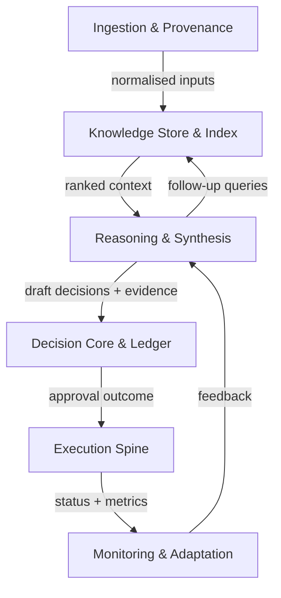

# Architecture

Prometheus mirrors the strategy OS blueprint defined in the `Promethus
Brief.md`. The system is an event-driven pipeline with fourteen capabilities
grouped into six core stages and eight supporting services. Each module owns a
contract in `common/` so teams can iterate or scale modules independently
without leaking implementation details.

## Guiding principles

- **Evidence first.** Events retain source IDs, citations, and masking
  decisions so reviewers can reconstruct every recommendation.
- **Modular by default.** Stages exchange immutable events rather than call
  each other directly, enabling replay, horizontal scale, and safe plugin
  swaps.
- **OSS friendly.** Default implementations prefer open-weight tooling with
  optional provider plugins gated by policy and telemetry.
- **Observability everywhere.** Metrics, traces, logs, and cost samples attach
  to every event to satisfy the monitoring and governance loops.

## Data and control flow

- **Ingestion → Knowledge.** Connectors normalise documents, scrub PII, attach
  provenance, and emit `IngestionNormalised` events that hydrate lexical and
  vector indexes.
- **Retrieval ↔ Reasoning.** Reasoning orchestrators call the retrieval API for
  hybrid search, rerank results, and iterate until they have grounded context
  to synthesise answers and strategy drafts.
- **Reasoning → Decision.** The decision core classifies decision type, enforces
  guardrails, adds alternatives, and records a ledger entry with evidence and
  review metadata.
- **Decision → Execution.** Approved strategies flow into the execution spine
  which maintains the program → initiative → tactic → deliverable graph and
  syncs to downstream tooling idempotently.
- **Monitoring loop.** Measurement, risk, forecasting, security, and
  observability modules feed telemetry back into reasoning for adaptation.

Supporting capabilities—causal modelling, forecasting, risk & assurance,
collaboration, observability, security, accessibility, and governance—expose
their own contracts but plug into this same event stream.

## Implementation snapshot (September 2025)

- `PrometheusOrchestrator` wires ingestion, retrieval, reasoning, decision,
  execution, and monitoring services with an in-process event bus.
- Ingestion ships filesystem, web, and synthetic connectors with asynchronous
  scheduling, SQLite storage, and optional PII redaction.
- Retrieval provides an in-memory baseline plus hybrid backends that
  integrate RapidFuzz, OpenSearch, Qdrant, and optional cross-encoder
  reranking.
- Reasoning exposes a deterministic summary/planner placeholder so downstream
  contracts stay stable while the model gateway evolves.
- Decision applies a lightweight policy stub that approves when recommended
  actions exist and records alternatives for downstream review.
- Execution offers Temporal, webhook, and in-memory adapters, attaching plan
  notes and Temporal worker metadata when configured.
- Monitoring emits `MonitoringSignal` events and routes metrics to the
  Prometheus Pushgateway and OpenTelemetry collectors when dependencies are
  available.

## Module contracts

- **Events** embed `event_id`, `correlation_id`, timestamps, actor, evidence
  references, schema version, and security labels.
- **Decision ledger** entries capture decision type (Type 1 vs Type 2),
  rationale, alternatives, approvals, risk posture, and next review date.
- **Causal models** persist as graphs keyed by strategy IDs with assumptions and
  metric bindings.
- **Observability payloads** must emit RED metrics, cost samples, and exemplar
  traces so quality gates can audit slow paths.

## Plugin architecture & isolation

- Plugins declare subscribed events, emitted events, required permissions, and
  SLA expectations in a manifest consumed at startup (manifest schema is on the
  roadmap and not yet implemented in code).
- Isolation strategies range from separate processes with gRPC contracts to
  WASI sandboxes for untrusted extensions; the core enforces timeouts and
  circuit breakers.
- The model gateway exposes a single RPC for completions, embeddings, and
  reranking so routing policies, fallbacks, and telemetry live in one place.

## Scaling profiles

- **Laptop mode:** single-process deployment with quantised models and local
  storage. Operators select the appropriate profile manually today; automatic
  benchmarking and warnings are planned for a future release.
- **Server mode:** each stage can run as a service with horizontal scale
  (retrieval shards, reasoning workers, monitoring pipelines) behind queues and
  backpressure.
- **SaaS multi-tenant:** tenancy is enforced via event metadata, per-tenant
  encryption keys, and strict RBAC policies. Canary rollouts and feature flags
  support zero-downtime releases.

## Data lifecycle

- Raw artefacts remain in encrypted ingestion buffers under retention policy.
- Normalised corpora power search indexes with per-tenant segregation.
- Reasoning artefacts and decision packets store alongside ledger entries with
  immutable audit history.
- Monitoring compacts telemetry into long-term warehouses for SLO and compliance
  dashboards.

## Walkthrough

1. A market report arrives; ingestion masks PII and publishes a normalised
   event.
2. Retrieval indexes the content and exposes it via the hybrid search API.
3. A strategist asks a question; reasoning runs a critique loop with sourced
   citations and explicit assumptions.
4. Decision core flags the recommendation as Type 1, requests CFO approval, and
   records alternatives.
5. Execution generates the initiative tree and syncs to the chosen PM tool.
6. Monitoring watches leading indicators; if KPIs drift or risk tolerance is
   breached, it kicks off a re-evaluation flow in reasoning.

This document reflects the architecture blueprint in the canonical brief. When
modules evolve, update this guide alongside the contracts in `common/` and the
capability descriptions in `docs/capability-map.md`.
