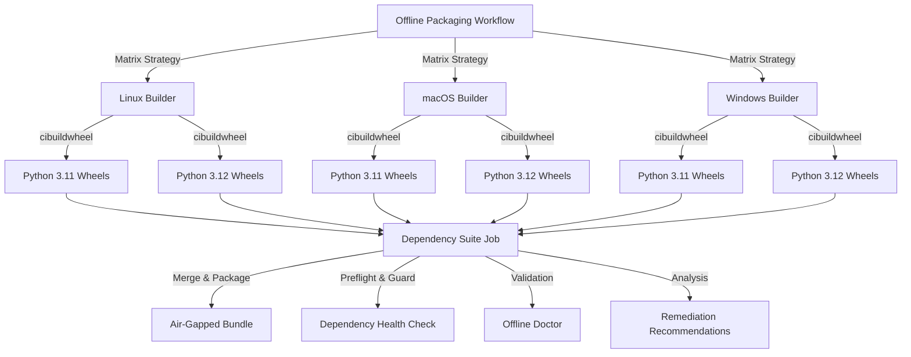

# Multi-Platform Wheel Building with cibuildwheel

## Overview

The offline-packaging workflow uses [cibuildwheel](https://cibuildwheel.readthedocs.io/) to build wheels for multiple Python versions and platforms, ensuring comprehensive support for air-gapped deployments across diverse environments.

## Architecture

### Remote Building (GitHub Actions)



### Local Integration (CLI)


## cibuildwheel Configuration

### Build Matrix

The workflow builds wheels for:

- **Python Versions**: 3.11, 3.12
- **Linux Architectures**: x86_64, aarch64 (via QEMU)
- **macOS Architectures**: x86_64 (Intel), arm64 (Apple Silicon)
- **Windows Architectures**: AMD64

### Environment Variables

```yaml
env:
  CIBW_BUILD: "cp311-* cp312-*"
  CIBW_SKIP: "*-musllinux_*"
  CIBW_ARCHS_LINUX: "x86_64 aarch64"
  CIBW_ARCHS_MACOS: "x86_64 arm64"
  CIBW_ARCHS_WINDOWS: "AMD64"
  CIBW_BUILD_VERBOSITY: 1
```

### Why cibuildwheel?

1. **Multi-Version Support**: Builds for multiple Python versions from single source
2. **Cross-Platform**: Consistent builds across Linux, macOS, Windows
3. **Cross-Architecture**: Supports ARM builds on x86 runners (QEMU)
4. **Binary Wheels**: Produces manylinux/universal wheels for maximum compatibility
5. **Testing**: Can run tests in each built wheel environment
6. **Caching**: Efficient caching of build dependencies

## Integration with Dependency Management

### Preflight Checks

Before building wheels, the workflow runs:

```bash
poetry run prometheus deps preflight --json > var/dependency-preflight/latest.json
```

This checks:
- Dependency resolution health
- Version conflicts
- Security vulnerabilities
- License compliance

### Upgrade Guard

After preflight, the upgrade guard assesses risks:

```bash
poetry run prometheus deps guard \
  --preflight var/dependency-preflight/latest.json \
  --output var/upgrade-guard/assessment.json \
  --markdown var/upgrade-guard/summary.md \
  --snapshot-root var/upgrade-guard/runs \
  --snapshot-tag "offline-packaging"
```

This provides:
- Risk assessment for each dependency
- Recommended upgrade paths
- Breaking change detection
- Security advisory mapping

### Offline Packaging

The orchestrator builds the complete air-gapped bundle:

```bash
poetry run prometheus offline-package \
  --output-dir vendor/offline \
  --auto-update \
  --auto-update-max minor
```

This:
- Downloads all dependency wheels
- Caches ML models
- Exports container images
- Generates checksums
- Creates deployment scripts

### Validation

The offline doctor validates the package:

```bash
poetry run prometheus offline-doctor \
  --package-dir vendor/offline \
  --format json > var/offline-doctor-results.json
```

Checks:
- All wheels present
- Checksums valid
- Manifests complete
- Dependencies resolvable

### Remediation

If validation finds issues, remediation runs:

```bash
poetry run prometheus remediation wheelhouse \
  --input var/offline-doctor-results.json \
  --output var/remediation-recommendations.json
```

This generates:
- Fallback version recommendations
- Binary wheel availability analysis
- Escape hatch suggestions (ALLOW_SDIST_FOR)
- Platform compatibility notes

## CLI Workflow

### 1. Download Artifacts

Download the `offline-packaging-suite-optimized` artifact from GitHub Actions:

```bash
gh run download <run-id> -n offline-packaging-suite-optimized
```

Or via web UI: Actions → Offline Packaging → Latest run → Artifacts

### 2. Extract to Repository

```bash
# Extract the artifact
tar -xzf airgapped-deployment-bundle.tar.gz

# Copy to vendor directory
cp -r airgapped-bundle/* vendor/
```

### 3. Sync Dependencies

```bash
# Sync dependency contracts and metadata
poetry run prometheus deps sync --apply --force

# This updates:
# - poetry.lock
# - constraints/production.txt
# - dist/requirements/
```

### 4. Validate Package

```bash
# Run comprehensive validation
poetry run prometheus offline-doctor \
  --package-dir vendor/offline \
  --format table

# Review any warnings or errors
```

### 5. Check Dependency Status

```bash
# View current dependency health
poetry run prometheus deps status

# Output includes:
# - Installed versions
# - Available updates
# - Security advisories
# - License information
```

### 6. Review Remediation

If there were build failures:

```bash
# View remediation recommendations
cat var/remediation-recommendations.json | jq .

# Apply recommended fixes
# e.g., pin to fallback version or add to ALLOW_SDIST_FOR
```

### 7. Plan Upgrades

```bash
# Generate upgrade plan
poetry run prometheus deps upgrade \
  --sbom var/dependency-sync/sbom.json \
  --metadata var/upgrade-guard/index/latest.json \
  --planner-limit 10

# Review recommended commands
# Apply with: --apply --yes
```

## Air-Gapped Deployment

### Bundle Contents

The air-gapped deployment bundle includes:

1. **Multi-Platform Wheelhouse**
   - Linux x86_64 and aarch64 wheels
   - macOS x86_64 and arm64 wheels
   - Windows AMD64 wheels
   - Python 3.11 and 3.12 variants

2. **Dependency Metadata**
   - `dependency-report.json` - Outdated packages
   - `var/dependency-preflight/latest.json` - Health check
   - `var/upgrade-guard/assessment.json` - Risk assessment
   - `var/upgrade-guard/summary.md` - Human-readable summary

3. **Validation Results**
   - `var/offline-doctor-results.json` - Package validation
   - `var/remediation-recommendations.json` - Fix suggestions

4. **Deployment Scripts**
   - `deploy.sh` - Automated deployment script
   - Checksums for integrity verification

### Deployment Script

The included `deploy.sh` script automates:

```bash
#!/bin/bash
# Air-gapped deployment automation

# 1. Extract archives
tar -xzf wheelhouse-all-platforms.tar.gz
tar -xzf models.tar.gz  # If present
tar -xzf images.tar.gz  # If present

# 2. Verify checksums
for checksum_file in *.sha256; do
  sha256sum -c "$checksum_file"
done

# 3. Install packages offline
python -m pip install --no-index \
  --find-links wheelhouse \
  -r wheelhouse/requirements.txt

# 4. Validate installation
python scripts/offline_doctor.py --package-dir .

# 5. Ready for use
poetry run prometheus --help
```

## Best Practices

### For Remote Builds

1. **Use workflow_dispatch** for on-demand platform selection
2. **Monitor build times** - cibuildwheel builds can take 20-30 minutes
3. **Review remediation** recommendations before merging changes
4. **Keep artifacts** for at least 30 days (configurable)

### For Local Integration

1. **Sync regularly** - Run `prometheus deps sync` after downloading new artifacts
2. **Validate first** - Always run `prometheus offline-doctor` before deployment
3. **Review guard status** - Check upgrade guard assessment before planning upgrades
4. **Follow remediation** - Apply recommendations for build failures
5. **Test offline** - Validate in disconnected environment before production

### For Air-Gapped Deployment

1. **Verify checksums** - Always validate integrity with provided .sha256 files
2. **Test platform match** - Ensure wheels match target platform architecture
3. **Use deploy.sh** - Leverage automated deployment script
4. **Keep documentation** - Include this guide in bundle
5. **Plan updates** - Schedule regular artifact downloads and syncs

## Troubleshooting

### cibuildwheel Build Failures

**Symptom**: Wheel build fails on specific platform

**Check**:
```bash
# Review platform manifest
cat vendor/wheelhouse/platform/linux_x86_64/manifest.json

# Look for build_tool: "cibuildwheel"
# Check for error messages in workflow logs
```

**Solutions**:
1. Review cibuildwheel configuration in workflow
2. Check for platform-specific build dependencies
3. Review remediation recommendations
4. Consider adding to ALLOW_SDIST_FOR temporarily

### Missing Wheels for Platform

**Symptom**: Required platform wheels not in artifact

**Check**:
```bash
# List available platforms
ls vendor/wheelhouse/platforms/

# Check if platform was in build matrix
cat vendor/wheelhouse/multi_platform_manifest.json
```

**Solutions**:
1. Trigger workflow with specific platforms input
2. Check if platform build job failed
3. Review artifact retention settings

### Sync Failures

**Symptom**: `prometheus deps sync` fails

**Check**:
```bash
# Verify artifact structure
ls -la vendor/wheelhouse/
ls -la var/dependency-preflight/
ls -la var/upgrade-guard/
```

**Solutions**:
1. Ensure all required files extracted
2. Check file permissions
3. Run with `--force` flag
4. Review sync logs for specific errors

### Validation Failures

**Symptom**: `prometheus offline-doctor` reports errors

**Check**:
```bash
# Get detailed error information
poetry run prometheus offline-doctor \
  --package-dir vendor/offline \
  --format json | jq .errors
```

**Solutions**:
1. Review `var/remediation-recommendations.json`
2. Check for missing wheels
3. Verify checksums
4. Re-download artifact if corrupted

## References

- [cibuildwheel Documentation](https://cibuildwheel.readthedocs.io/)
- [Workflow Orchestration Guide](./workflow-orchestration.md)
- [Dependency Management Pipeline](./dependency-management-pipeline.md)
- [Offline Packaging Orchestrator](./offline-packaging-orchestrator.md)
- [CLI Reference](../prometheus/cli.py)
