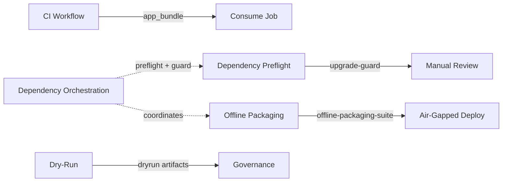

# Cross-Workflow Integration Guide

## Overview

This guide explains how GitHub workflows in the Prometheus project coordinate and share resources to optimize pipeline execution while maintaining isolation.

## Artifact Sharing Strategy

### Current Artifact Flow



### Artifact Retention Policy

| Artifact Name | Retention | Cleanup Strategy | Used By |
|--------------|-----------|------------------|---------|
| `app_bundle` | 30 days | Keep last 5 | CI → consume job |
| `offline-packaging-suite-optimized` | 30 days | Keep last 5 | Offline packaging → operators |
| `upgrade-guard` | 30 days | No cleanup | Dependency preflight → review |
| `dependency-pipeline-{run_id}` | 30 days | No cleanup | Dependency orchestration → review |
| `dryrun-{shard}-{run_id}` | 7 days | No cleanup | Dry-run → governance |
| `dependency-report` | 7 days | No cleanup | Dependency check → review |
| `wheels-{os}-{arch}` | 7 days | Auto (transient) | Build-wheels → dependency-suite |

## Workflow Coordination Patterns

### 1. Sequential Dependency Pattern

**Use Case**: Dependency contract check must pass before building wheelhouse

**Implementation**:
- Dependency contract check runs on PR
- If drift detected, blocks merge
- CI workflow assumes clean state

**Benefits**:
- Prevents building with stale dependencies
- Enforces contract hygiene
- Clear failure signal

### 2. Parallel Execution Pattern

**Use Case**: Multiple dry-run shards execute simultaneously

**Implementation**:
```yaml
strategy:
  fail-fast: false
  matrix:
    include:
      - shard: baseline
      - shard: ingestion-scan
      - shard: policy-audit
```

**Benefits**:
- Faster total execution time
- Independent shard failures
- Parallel artifact generation

### 3. Orchestration Pattern

**Use Case**: Dependency orchestration coordinates multiple stages

**Implementation**:
```yaml
on:
  workflow_dispatch:
    inputs:
      run-preflight: { type: boolean, default: true }
      run-guard: { type: boolean, default: true }
      run-planner: { type: boolean, default: false }
```

**Benefits**:
- Single workflow for full pipeline
- Configurable execution
- Unified artifact output

### 4. Conditional Trigger Pattern

**Use Case**: Offline packaging only runs on schedule or manual

**Implementation**:
```yaml
on:
  schedule:
    - cron: "0 3 * * 1"  # Weekly Monday 3AM
  workflow_dispatch:
```

**Benefits**:
- Reduces unnecessary builds
- Saves resources
- Predictable execution schedule

## Composite Action Usage

### Pattern 1: Standard Python Setup

```yaml
- name: Setup Python and Poetry
  uses: ./.github/actions/setup-python-poetry
  with:
    python-version: "3.12"
    poetry-version: "1.8.3"
    cache-pip: "true"
    install-poetry-export: "true"
```

**Use in**: All workflows requiring Poetry

### Pattern 2: Wheelhouse Building

```yaml
- name: Build wheelhouse
  uses: ./.github/actions/build-wheelhouse
  with:
    output-dir: "dist/wheelhouse"
    extras: "pii,observability,rag,llm,governance,integrations"
    include-dev: "true"
    include-pip-audit: "true"
    validate: "true"
```

**Use in**: CI, Dependency Preflight, Offline Packaging

### Pattern 3: Artifact Verification

```yaml
- name: Verify artifacts
  uses: ./.github/actions/verify-artifacts
  with:
    artifact-dir: "dist"
    run-offline-doctor: "true"
    run-verify-script: "true"
    fail-on-warnings: "false"
```

**Use in**: CI, Offline Packaging

## Shared Resources

### 1. Configuration Files

All workflows reference shared configuration:

- `configs/dependency-profile.toml` - Dependency policy
- `configs/defaults/pipeline_local.toml` - Pipeline config
- `configs/defaults/dependency_snapshot_request.json` - Temporal config
- `constraints/runtime-roots.txt` - Runtime dependencies

**Coordination**: Changes to these files trigger relevant workflows

### 2. Scripts

Shared scripts used across workflows:

- `scripts/build-wheelhouse.sh` - Called by build-wheelhouse action
- `scripts/offline_doctor.py` - Called by verify-artifacts action
- `scripts/verify_artifacts.sh` - Called by verify-artifacts action
- `scripts/manage-deps.sh` - Called by CI and preflight
- `scripts/check-macos-cruft.sh` - Called by CI and preflight

**Coordination**: Script changes are tested in CI before merge

### 3. Composite Actions

Reusable actions provide consistency:

- `.github/actions/setup-python-poetry/` - 1.8.3 standard
- `.github/actions/build-wheelhouse/` - Wheelhouse building
- `.github/actions/verify-artifacts/` - Artifact validation

**Coordination**: Action changes affect all dependent workflows

## Environment Variable Coordination

### Shared Environment Variables

```yaml
env:
  POETRY_NO_INTERACTION: "1"
  PYTHONIOENCODING: utf-8
  GIT_LFS_SKIP_SMUDGE: "1"
```

### Workflow-Specific Variables

Set via repository secrets/variables:

| Variable | Used By | Purpose |
|----------|---------|---------|
| `TEMPORAL_SNAPSHOT_HOST` | Dependency Preflight, Orchestration | Temporal endpoint |
| `TEMPORAL_SNAPSHOT_NAMESPACE` | Dependency Preflight, Orchestration | Temporal namespace |
| `DEPENDENCY_GUARD_SLACK_WEBHOOK` | Dependency Preflight, Orchestration | Notifications |
| `GITHUB_TOKEN` | All workflows | GitHub API access |

## Preventing Race Conditions

### 1. Artifact Naming

Use unique identifiers:
```yaml
name: dryrun-${{ matrix.shard }}-${{ github.run_id }}
```

### 2. Cleanup Coordination

Cleanup jobs respect workflow boundaries:
```yaml
if: github.event_name != 'pull_request'  # Don't clean on PR
```

### 3. Lock Files

Poetry lock file coordination:
- Contract check enforces clean state
- Manual changes require `prometheus deps sync`
- Renovate bot updates trigger preflight

## Workflow Dependencies

### Implicit Dependencies

```
dependency-contract-check (PR gate)
  ↓
ci (build + test)
  ↓
consume (validation)

dependency-preflight (scheduled)
  ↓
dependency-orchestration (manual/scheduled)
  ↓
offline-packaging (scheduled)
```

### Explicit Dependencies

Some workflows have job-level dependencies:

```yaml
publish:
  needs: build  # Explicit dependency
  
consume:
  needs: [build, publish]  # Multiple dependencies
```

## Troubleshooting Integration Issues

### Issue: Composite Action Not Found

**Symptom**: `Error: Unable to resolve action ./.github/actions/...`

**Cause**: Workflow triggered before composite action merged

**Solution**: 
1. Ensure composite actions are on target branch
2. Use `actions/checkout@v5` with correct ref
3. Check action.yml exists at expected path

### Issue: Artifact Not Found

**Symptom**: `Error: Artifact 'X' not found`

**Cause**: Artifact expired or not yet created

**Solution**:
1. Check retention days setting
2. Verify upstream job completed successfully
3. Check artifact naming matches exactly

### Issue: Poetry Version Mismatch

**Symptom**: `Error: Poetry version X does not match expected Y`

**Cause**: Workflow not using composite action or wrong version

**Solution**:
1. Use `setup-python-poetry` composite action
2. Verify `poetry-version: "1.8.3"` input
3. Check no manual pip install poetry commands

### Issue: Wheelhouse Build Fails

**Symptom**: `Error: Wheelhouse build failed`

**Cause**: Missing dependencies or binary wheel unavailable

**Solution**:
1. Check `build-wheelhouse` action logs
2. Review `platform_manifest.json` for sdist usage
3. Check remediation summary in wheelhouse/remediation/
4. Use `ALLOW_SDIST_FOR` as temporary escape hatch

### Issue: Workflow Concurrency Conflicts

**Symptom**: Multiple workflow runs interfere with each other

**Cause**: No concurrency limits defined

**Solution**:
```yaml
concurrency:
  group: ${{ github.workflow }}-${{ github.ref }}
  cancel-in-progress: true  # For non-main branches
```

## Best Practices

### 1. Use Composite Actions

✅ **Do**:
```yaml
- uses: ./.github/actions/setup-python-poetry
  with:
    poetry-version: "1.8.3"
```

❌ **Don't**:
```yaml
- run: |
    pip install poetry==1.8.3
```

### 2. Name Artifacts Consistently

✅ **Do**:
```yaml
name: ${{ github.workflow }}-${{ github.run_id }}
```

❌ **Don't**:
```yaml
name: my-artifact  # Can conflict across runs
```

### 3. Set Retention Appropriately

✅ **Do**:
```yaml
retention-days: 30  # Production artifacts
retention-days: 7   # Transient artifacts
```

❌ **Don't**:
```yaml
# No retention-days = default 90 days = wasted storage
```

### 4. Document Dependencies

✅ **Do**:
```yaml
# This workflow requires:
# - Repository secret: TEMPORAL_SNAPSHOT_HOST
# - Composite action: setup-python-poetry
```

❌ **Don't**:
```yaml
# No documentation of external dependencies
```

### 5. Use Workflow Dispatch Carefully

✅ **Do**:
```yaml
workflow_dispatch:
  inputs:
    dry-run:
      description: "Run in dry-run mode"
      type: boolean
      default: true
```

❌ **Don't**:
```yaml
workflow_dispatch:  # No inputs = no control
```

## Future Improvements

### Planned Enhancements

1. **Shared Cache Strategy**
   - Cache Poetry dependencies across workflows
   - Share wheelhouse artifacts between CI and offline-packaging
   - Implement cache warming job

2. **Workflow Reusability**
   - Convert common job patterns to reusable workflows
   - Create composite workflows for full pipelines
   - Enable cross-repository workflow calls

3. **Enhanced Coordination**
   - Add workflow_run triggers for automatic chaining
   - Implement artifact inheritance patterns
   - Create workflow status dashboard

4. **Improved Observability**
   - Add OpenTelemetry spans to workflows
   - Create unified workflow metrics
   - Implement alert routing for failures

## References

- [GitHub Actions Documentation](https://docs.github.com/en/actions)
- [Composite Actions Guide](https://docs.github.com/en/actions/creating-actions/creating-a-composite-action)
- [Workflow Orchestration Guide](./workflow-orchestration.md)
- [Dependency Management Pipeline](./dependency-management-pipeline.md)
- [CI Pipeline Documentation](../CI/README.md)
