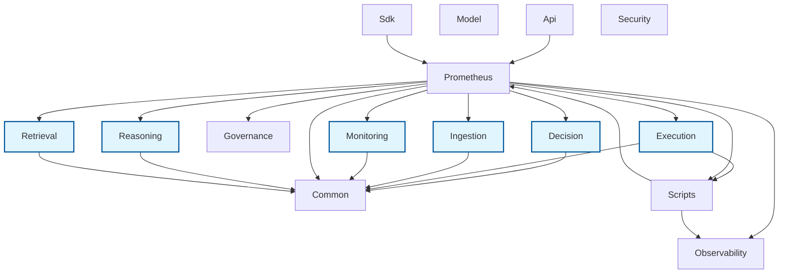

# Prometheus Dependency Graph

This diagram shows the internal dependencies between Prometheus modules.
Generated automatically by `scripts/generate_dependency_graph.py`.

## Module Dependencies

## Module Details

### Api
- Files: 4
- Internal dependencies: prometheus
- External dependencies: __future__, dataclasses, datetime, fastapi, functools, os, pathlib, pydantic, typing, uvicorn

### Common
- Files: 10
- External dependencies: __future__, collections, dataclasses, datetime, typing, uuid

### Decision
- Files: 2
- Internal dependencies: common
- External dependencies: __future__, dataclasses

### Execution
- Files: 6
- Internal dependencies: common, scripts
- External dependencies: __future__, asyncio, collections, dataclasses, datetime, importlib, json, logging, pathlib, requests, ...

### Governance
- Files: 4
- External dependencies: __future__, collections, dataclasses, datetime, typing

### Ingestion
- Files: 7
- Internal dependencies: common
- External dependencies: __future__, asyncio, collections, dataclasses, datetime, hashlib, httpx, json, pathlib, presidio_analyzer, ...

### Model
- Files: 6
- External dependencies: __future__, collections, dataclasses, pathlib, typing

### Monitoring
- Files: 4
- Internal dependencies: common
- External dependencies: __future__, collections, dataclasses, importlib, json, pathlib, typing

### Observability
- Files: 4
- External dependencies: __future__, collections, datetime, importlib, json, logging, opentelemetry, os, prometheus_client, socket, ...

### Prometheus
- Files: 17
- Internal dependencies: common, decision, execution, governance, ingestion, monitoring, observability, reasoning, retrieval, scripts
- External dependencies: __future__, argparse, collections, contextlib, copy, dataclasses, datetime, evaluation, fnmatch, functools, ...

### Reasoning
- Files: 2
- Internal dependencies: common
- External dependencies: __future__, dataclasses

### Retrieval
- Files: 5
- Internal dependencies: common
- External dependencies: __future__, argparse, collections, dataclasses, datetime, difflib, importlib, json, logging, math, ...

### Scripts
- Files: 16
- Internal dependencies: observability, prometheus
- External dependencies: __future__, argparse, ast, collections, concurrent, contextlib, dataclasses, datetime, fnmatch, hashlib, ...

### Sdk
- Files: 2
- Internal dependencies: prometheus
- External dependencies: __future__, dataclasses, pathlib

### Security
- Files: 4
- External dependencies: __future__, dataclasses, enum, os, typing
