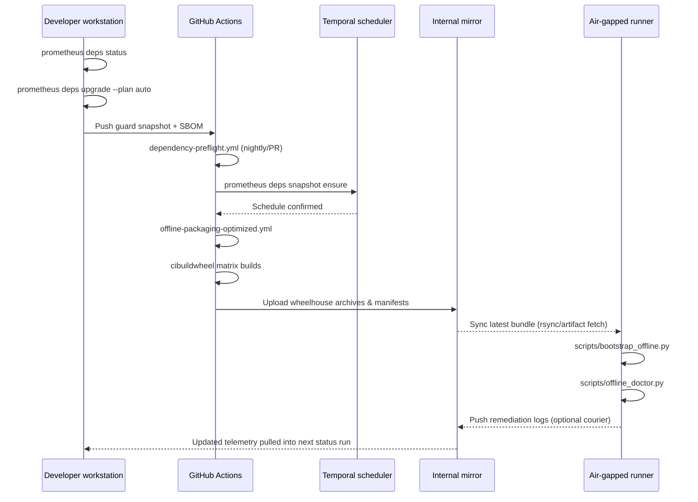

# Dependency Management & Air-Gapped Packaging Pipeline

This guide documents the end-to-end subsystem that keeps Prometheus
installable everywhere, even on air-gapped runners. It focuses on the tooling
that surrounds (and feeds) the core platform: policy enforcement, dependency
analysis, packaging automation, artifact mirroring, and the delivery paths
that guarantee every environment can hydrate itself with vetted wheels.

> **📘 Quick Start**: For step-by-step orchestration guidance, see the
> [Dependency Pipeline Orchestration Guide](./dependency-pipeline-orchestration.md).

## Purpose & scope

- **Unify policy, planning, and packaging.** Explain how contract metadata,
  telemetry, and SBOM snapshots inform automated upgrade recommendations.
- **Codify CI and local collaboration.** Highlight the workflows that build
  wheelhouses with cibuildwheel, publish bundle archives, and keep mirrors in
  sync.
- **Serve air-gapped operators.** Describe the controls that ensure offline
  runners can bootstrap, validate, and stay patched without external network
  access.
- **Clarify ownership boundaries.** Everything here is "Prometheus adjacent";
  the compute pipeline consumes the outputs but remains decoupled by design.

## System landscape

- **Policy & telemetry**
  - Defines the allowed dependency state and captures observed reality.
  - Assets: `configs/dependency-profile.toml`, SBOM archives in
    `var/upgrade-guard/`, metadata indexes.
- **Guard & drift analysis**
  - Detects divergence, rates severity, and emits evidence bundles.
  - Assets: `scripts/upgrade_guard.py`, `scripts/dependency_drift.py`, guard
    snapshots.
- **Planner & autoresolver**
  - Produces executable upgrade plans with weighted scoring.
  - Assets: `scripts/upgrade_planner.py`, `prometheus deps upgrade`.
- **Scheduling & notifications**
  - Automates cadence, schedule refresh, and notification fan-out.
  - Assets: `execution/schedules.py`, Temporal schedules, CI cron jobs.
- **Packaging & build**
  - Produces vetted wheels across Linux, macOS, and Windows.
  - Assets: `scripts/offline_package.py`, `cibuildwheel`,
    `.github/workflows/offline-packaging-optimized.yml`.
- **Mirroring & distribution**
  - Synchronises wheelhouses, constraints, and manifests between locations.
  - Assets: `scripts/sync-dependencies.py`, `scripts/mirror_manager.py`,
    `vendor/wheelhouse/`.
- **Remediation & reporting**
  - Surfaces status, dashboards, and GitHub summaries for operators.
  - Assets: `prometheus/cli.py` (`deps status`, `deps upgrade`, `remediation`),
    `prometheus/remediation/*`.
- **Governance & compliance**
  - Captures audit evidence, lineage, and promotion approval trails.
  - Assets: `governance/audit.py`, `governance/lineage.py`,
    `governance/reports.py`, policy addenda in `docs/dependency-upgrade-architecture.md`.
- **Security & supply chain integrity**
  - Enforces signature policy, secret retrieval, and publisher trust rules.
  - Assets: contract `signature_policy` entries, `security/policy.py`,
    `security/secrets.py`, attestation verification baked into guard runs.
- **Observability & feedback loops**
  - Streams telemetry for dashboards, metrics, and incident response.
  - Assets: OpenTelemetry spans from CLI commands, `monitoring/dashboards.py`,
    Grafana boards described in `docs/observability.md`.
- **Air-gapped hydration**
  - Bootstraps isolated runners and validates readiness.
  - Assets: `scripts/bootstrap_offline.py`, `scripts/offline_doctor.py`,
    generated bundles.

## Lifecycle overview

```mermaid
flowchart TD
    Policy[Contract & policy profiles
    configs/dependency-profile.toml] --> Sync[scripts/sync-dependencies.py
    (SBOM + wheel audit)]
    Metadata[Metadata snapshots
    var/upgrade-guard/index/*.json] --> Sync
    Sync --> SBOM[Signed SBOM + input bundle]
    SBOM --> Guard[scripts/upgrade_guard.py
    (risk aggregation)]
    Guard --> Planner[scripts/upgrade_planner.py
    (weighted plans)]
    Planner -->|Recommended commands| CLI[prometheus deps upgrade]
    CLI --> Packaging[scripts/offline_package.py
    + cibuildwheel matrix builds]
    Packaging --> Mirror[scripts/mirror_manager.py /
    vendor/wheelhouse]
    Mirror --> Bundles[wheelhouse archives
    + manifests]
    Bundles --> AirGap[Air-gapped runners
    (bootstrap_offline.py)]
    AirGap --> Doctor[scripts/offline_doctor.py
    (validation)]
    Doctor --> Telemetry[packaging-run.json
    + remediation logs]
    Telemetry --> Guard
```

Key feedback loops:

1. Guard snapshots carry policy context, severity, and artefact references
   back into future runs.
2. Packaging manifests (`vendor/packaging-run.json`) and remediation reports
   augment telemetry so drifts can be traced to specific build attempts.
3. Temporal schedules and CI workflows watchdog staleness (contract drift,
   SBOM max age, wheelhouse recency) and trigger rebuilds automatically.

## Subsystem details

### Policy, contracts, and telemetry

- `configs/dependency-profile.toml` codifies signature requirements, update
  cadences, snoozes, and per-environment alignment rules.
- `scripts/sync-dependencies.py` normalises the project environment, captures
  dependency manifests, and writes CycloneDX SBOMs alongside poetry export
  artefacts under `var/dependency-sync/`.
- Metadata indexes (`var/upgrade-guard/index/<timestamp>.json`) record the
  authoritative version catalog used by drift analysis and planners.
- SBOMs and metadata are signed where policy demands it; signatures are
  verified before consumption by guard or planner steps.

### Guard and drift analysis

- `scripts/dependency_drift.py` compares resolved dependencies against the
  metadata index, tagging each package with `up-to-date`, `patch_available`,
  `minor_available`, or `major_available` states, plus resolver blockers.
- `scripts/upgrade_guard.py` merges drift data with SBOM audits, Renovate
  advice, CVE feeds, and contract policies, emitting:
  - Machine-readable JSON (`var/upgrade-guard/<run-id>/reports/*.json`).
  - Markdown summaries for stakeholders.
  - Telemetry (OpenTelemetry spans, Prometheus metrics via the CLI).
- Guard severities (`safe`, `needs-review`, `blocked`) flow into CI gates and
  into the `prometheus deps status` aggregation.
- Severity thresholds drive dependency-preflight workflow outcomes: merges
  are blocked when the guard reports `needs-review` or worse.

### Planner and autoresolver

- `scripts/upgrade_planner.py` weighs candidate upgrades using recency,
  severity, resolver success probability, and policy allowances.
- `prometheus deps upgrade` (Typer command in `prometheus/cli.py`) renders a
  scoreboard of candidates, optional dry runs, and can execute `poetry`
  commands directly (`--apply --yes`).
- Planner and guard share snapshot directories so the full decision context is
  auditable post-run.

### Scheduling and notifications

- `execution/schedules.py` provisions Temporal schedules via
  `prometheus deps snapshot ensure`, ensuring dependency snapshots refresh on
  a predictable cadence.
- GitHub workflows (`dependency-preflight`, `dependency-contract-check`,
  `offline-packaging-optimized`) consume the same configuration bundles so CI,
  staging, and production stay aligned.
- Notifications fan out through guard Markdown, GitHub summary comments
  (`python -m prometheus.remediation.github_summary`), and dashboards.

### Packaging & CI builds

- `scripts/offline_package.py` orchestrates wheelhouse refreshes, model
  downloads, container exports, and telemetry generation.
- `cibuildwheel` runs inside `.github/workflows/offline-packaging-optimized.yml`
  to build platform-specific wheels, archive them, and upload artefacts for
  downstream mirroring.
- The workflow enforces repository hygiene (Git LFS hydration, clean checkouts,
  checksum generation) before promoting new bundles.
- Every build step consults guard severity; runs against a blocked guard
  either fail fast or skip promotion.
- Outputs include:
  - `vendor/wheelhouse/` populated with fresh wheels and
    platform manifests under `vendor/wheelhouse/platform/`.
  - Compressed archives (e.g. `wheelhouse.tar.gz`) for quick distribution.
  - `vendor/packaging-run.json` describing run configuration, policy inputs,
    and timing metadata for auditing.
  - GitHub Actions artefacts for each wheelhouse archive, plus optional LFS
    pushes when binary assets change.

### Mirroring & distribution

- `scripts/mirror_manager.py` and `scripts/sync-dependencies.py` keep
  wheelhouses, constraint files, and runtime root manifests synchronised
  between local repos and remote storage.
- Mirrors store both raw wheel directories and compressed archives so
  couriers can choose the transport best suited to their environment.
- `scripts/manage-deps.sh --prune` cleans stale artefacts after successful
  promotions, preventing bloat on long-lived mirrors.
- Mirror health is reported via `prometheus deps mirror --status` and
  cross-checked against guard metadata expiry windows.

### Remediation, reporting, and observability

- `prometheus deps status` aggregates guard and planner results, exporting to
  JSON/Markdown and colouring terminal output by severity.
- `prometheus remediation wheelhouse` and `prometheus remediation runtime`
  capture missing artefacts or runtime misconfigurations, writing actionable
  summaries for operators.
- OpenTelemetry spans and Prometheus counters (initialised in
  `prometheus/cli.py`) give SREs visibility into CLI usage, durations, and
  exit codes.

### Air-gapped hydration & validation

- `scripts/bootstrap_offline.py` hydrates isolated runners by unpacking
  packaged wheelhouse archives, localising constraints, and wiring Poetry.
- The script expects a mirror URL (file, rsync, or HTTP) that points to the
  wheelhouse archive published from CI; it writes manifests into
  `vendor/wheelhouse/` for parity with online environments.
- `scripts/offline_doctor.py` verifies Python, pip, Poetry, Docker, and wheel
  presence before orchestration begins; remediation pointers are logged via
  the `prometheus.remediation` helpers.
- Generated manifests (`vendor/CHECKSUMS.sha256`, packaging telemetry) allow
  auditors to confirm artefact integrity without internet access.
- Air-gapped operators can re-run `prometheus deps status` offline by feeding
  the mirrored SBOM and metadata, ensuring policy enforcement remains active.

## Cross-cutting interactions

### Governance and audit trails

- Guard and planner snapshots double as immutable audit evidence; SREs push
  the resulting JSON bundles into `governance/audit.py` append-only ledgers or
  lineage emitters in `governance/lineage.py`.
- `docs/dependency-upgrade-architecture.md` captures the policy hooks that
  auditors use when reviewing packaging promotions. Link promotion requests to
  these snapshots so reviewers can replay every decision.
- `docs/quality-gates.md` lists the merge blockers tied to guard severity.
  When the guard escalates to `needs-review`, CI blocks promotion until
  governance sign-off lands.

### Security & supply-chain integrity

- Signature requirements defined in `configs/dependency-profile.toml` flow
  through guard execution; the guard verifies attested SBOMs and wheelhouse
  manifests before planner or packaging stages can progress.
- The security scaffold (`security/policy.py`, `security/secrets.py`)
  surfaces helpers for signing, verifying, and retrieving credentials needed
  by CI runners and air-gapped couriers.
- Packaging workflows honour provenance checks by verifying checksums recorded
  in `vendor/CHECKSUMS.sha256` and by bundling `packaging-run.json` so
  consumers can confirm exactly which policy inputs produced a wheelhouse.

### Observability and incident response

- Guard, planner, and remediation CLIs emit OpenTelemetry spans and Prometheus
  counters that feed the dashboards shipped in `monitoring/dashboards.py`.
- `docs/observability.md` documents how those signals surface on Grafana and
  how incident responders slice per-stage latency or drift severity.
- `prometheus remediation github_summary` publishes run status to GitHub
  summary sections, giving responders a fast path to failure context.

### Developer experience & quality gates

- `scripts/manage-deps.sh --prune`, `scripts/build-wheelhouse.sh`, and the
  offline packaging orchestrator keep local environments in sync with CI. The
  same scripts underpin `docs/offline-packaging-orchestrator.md` runbooks.
- Developers run `trunk check` and the `dependency-preflight` workflow to
  assert guard stability before committing packaging artefacts.
- Repository-wide planning happens in `docs/dependency-upgrade-todos.md`,
  tracking ownership for open remediation and policy follow-ups.

### Resilience & disaster recovery

- `docs/offline-contingency.md` and `docs/offline-packaging-orchestrator.md`
  prescribe fallback transports (portable drives, artefact archives) when
  mirrors are unreachable.
- Mirror promotion preserves historical bundles so operators can roll back to
  a known-good archive if a regression slips through guard checks.
- Couriers store remediation exports alongside wheelhouse packages, ensuring
  cold sites can replay doctor runs and verify readiness without live access.

## Cross-cutting interactions

### Governance and audit trails

- Guard and planner snapshots double as immutable audit evidence; SREs push
  the resulting JSON bundles into `governance/audit.py` append-only ledgers or
  lineage emitters in `governance/lineage.py`.
- `docs/dependency-upgrade-architecture.md` captures the policy hooks that
  auditors use when reviewing packaging promotions. Link promotion requests to
  these snapshots so reviewers can replay every decision.
- `docs/quality-gates.md` lists the merge blockers tied to guard severity.
  When the guard escalates to `needs-review`, CI blocks promotion until
  governance sign-off lands.

### Security & supply-chain integrity

- Signature requirements defined in `configs/dependency-profile.toml` flow
  through guard execution; the guard verifies attested SBOMs and wheelhouse
  manifests before planner or packaging stages can progress.
- The security scaffold (`security/policy.py`, `security/secrets.py`)
  surfaces helpers for signing, verifying, and retrieving credentials needed
  by CI runners and air-gapped couriers.
- Packaging workflows honour provenance checks by verifying checksums recorded
  in `vendor/CHECKSUMS.sha256` and by bundling `packaging-run.json` so
  consumers can confirm exactly which policy inputs produced a wheelhouse.

### Observability and incident response

- Guard, planner, and remediation CLIs emit OpenTelemetry spans and Prometheus
  counters that feed the dashboards shipped in `monitoring/dashboards.py`.
- `docs/observability.md` documents how those signals surface on Grafana and
  how incident responders slice per-stage latency or drift severity.
- `python -m prometheus.remediation.github_summary` publishes run status to GitHub
  summary sections, giving responders a fast path to failure context.

### Developer experience & quality gates

- `scripts/manage-deps.sh --prune`, `scripts/build-wheelhouse.sh`, and the
  offline packaging orchestrator keep local environments in sync with CI. The
  same scripts underpin `docs/offline-packaging-orchestrator.md` runbooks.
- Developers run `trunk check` and the `dependency-preflight` workflow to
  assert guard stability before committing packaging artefacts.
- Repository-wide planning happens in `docs/dependency-upgrade-todos.md`,
  tracking ownership for open remediation and policy follow-ups.

### Resilience & disaster recovery

- `docs/offline-contingency.md` and `docs/offline-packaging-orchestrator.md`
  prescribe fallback transports (portable drives, artefact archives) when
  mirrors are unreachable.
- Mirror promotion preserves historical bundles so operators can roll back to
  a known-good archive if a regression slips through guard checks.
- Couriers store remediation exports alongside wheelhouse packages, ensuring
  cold sites can replay doctor runs and verify readiness without live access.

## CI coordination sequence



## Operational runbooks

1. **Routine health check**
   - Run `prometheus deps status` locally; ensure guard severity is `safe`.
   - Inspect `vendor/packaging-run.json` from the most recent packaging run.
   - Confirm Temporal schedule freshness via `prometheus deps snapshot ensure`.

2. **Promoting a new wheelhouse**
   - Trigger the packaging workflow (manual dispatch) or run
     `poetry run python scripts/offline_package.py` locally.
   - Verify outputs with `scripts/offline_doctor.py --format table`.
   - Publish archives to the mirror using `scripts/mirror_manager.py promote`.
   - Push datasets to Git LFS if new binaries were produced and ensure the
     GitHub workflow artefacts were uploaded successfully.
   - Regenerate guard status to validate the new artefacts.

3. **Air-gapped bootstrap**
   - Transfer the latest wheelhouse archive, constraint bundle, and
     `packaging-run.json`.
   - Execute `scripts/bootstrap_offline.py --wheelhouse-url file:///path`.
   - Run `scripts/offline_doctor.py` and address remediation prompts before
     allowing job execution.

## Artefact inventory

- **Contract profile**
  - Location: `configs/dependency-profile.toml`.
  - Producer: Platform team.
  - Consumers: Guard and planner subsystems.
- **SBOM snapshot**
  - Location: `var/dependency-sync/*.json`.
  - Producer: `scripts/sync-dependencies.py`.
  - Consumers: Guard, planner, CI workflows.
- **Guard run bundle**
  - Location: `var/upgrade-guard/<run-id>/`.
  - Producer: `scripts/upgrade_guard.py`.
  - Consumers: CLI (`prometheus deps status`), dashboards, auditors.
- **Upgrade plan**
  - Location: `var/upgrade-guard/<run-id>/reports/plan.json`.
  - Producer: Planner.
  - Consumers: Operators, automation pipelines.
- **Packaging manifest**
  - Location: `vendor/packaging-run.json`.
  - Producer: Offline packaging orchestrator.
  - Consumers: Auditors, SRE teams, air-gapped validation.
- **Wheelhouse archive**
  - Location: workflow artefacts (for example `wheelhouse.tar.gz`).
  - Producer: cibuildwheel workflow.
  - Consumers: Internal mirrors, air-gapped runners, disaster-recovery sites.
- **Runtime roots**
  - Location: `constraints/runtime-roots.txt`.
  - Producer: `scripts/sync-dependencies.py`.
  - Consumers: Bootstrap scripts, runtime verification.
- **Remediation logs**
  - Location: `prometheus/remediation/*.json`.
  - Producer: Remediation CLI.
  - Consumers: Operators and incident response teams.

## Guardrails and failure modes

- **Policy drift:** Guard severity escalates when SBOM age exceeds
  `sbom_max_age_days` or contract update windows elapse. CI blocks merges until
  severity returns to `safe`.
- **Resolver failure:** Planner marks candidates `blocked`; remediation hints
  are surfaced in CLI output and guard markdown.
- **Packaging regressions:** Offline doctor fails the run if wheelhouse audits
  detect missing wheels; remediation commands record the gaps for review.
- **Mirror staleness:** Mirror status checks raise alerts when artefact ages
  exceed policy thresholds or checksum mismatches occur.
- **Air-gapped validation:** Bootstrap script halts when manifests or checksums
  are missing; operators must re-hydrate from a known-good archive.

## Extensibility checklist

When extending this subsystem:

1. **Update contracts first.** Add new policy fields or artefact references to
   `configs/dependency-profile.toml` so downstream automation sees the change.
2. **Regenerate telemetry.** Ensure guard/planner snapshots carry the extra
   data; add unit tests under `tests/unit/scripts/` for new behaviours.
3. **Expose via CLI.** Extend `prometheus/cli.py` to surface new knobs while
   preserving backwards compatibility for programmatic consumers.
4. **Document mirrors.** Capture mirror format or retention adjustments in
   `docs/offline-packaging-orchestrator.md` and this guide.
5. **Validate air-gapped flow.** Run the offline doctor and bootstrap scripts
   with the new artefacts to guarantee sealed environments can reload them.

With these guardrails, Prometheus’ dependency management and packaging stack
remains deterministic, auditable, and ready for the most restrictive runtime
constraints.
