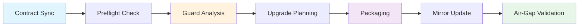

# Dependency Pipeline Orchestration Guide

This document provides operational guidance for orchestrating the dependency management pipeline, detailing how each component connects, when to invoke each tool, and how to troubleshoot common issues.

## Pipeline Overview

The dependency management pipeline consists of several interconnected stages that work together to maintain a healthy, secure, and air-gapped-ready dependency ecosystem:



## Stage-by-Stage Orchestration

### Stage 1: Contract Synchronization

**Command**: `prometheus deps sync`

**Purpose**: Ensures dependency manifests match the contract policy defined in `configs/dependency-profile.toml`.

**When to Run**:
- After modifying `configs/dependency-profile.toml`
- Before packaging for air-gapped deployment
- When CI detects contract drift

**Inputs**:
- `configs/dependency-profile.toml` - Master contract file
- `poetry.lock` - Current lock state

**Outputs**:
- `constraints/runtime-roots.txt` - Runtime dependency constraints
- `dist/requirements.txt` - Distribution requirements
- `vendor/wheelhouse/runtime-roots.txt` - Wheelhouse requirements
- Various manifest files in sync with contract

**Example Usage**:
```bash
# Preview changes
prometheus deps sync

# Apply changes
prometheus deps sync --apply --force

# Use custom contract location
prometheus deps sync --contract configs/custom-profile.toml --apply
```

**Exit Codes**:
- `0` - Success, manifests are in sync
- `1` - Drift detected or validation failed
- `2` - Invalid contract or file access error

---

### Stage 2: Preflight Validation

**Command**: `prometheus deps preflight`

**Purpose**: Validates that binary wheels exist for all dependencies across required Python versions and platforms.

**When to Run**:
- Before upgrades or in CI to catch packaging issues early
- After adding new dependencies
- Before releasing a new version

**Inputs**:
- `poetry.lock` - Dependency lock file
- Optional: platform and Python version constraints

**Outputs**:
- JSON report of wheel availability
- Exit code indicating success/failure

**Example Usage**:
```bash
# Basic preflight check
prometheus deps preflight

# Output as JSON
prometheus deps preflight --json > var/dependency-preflight/latest.json

# Check specific packages
prometheus deps preflight --packages argon2-cffi pandas

# Check for specific platforms
prometheus deps preflight --platforms "manylinux2014_x86_64" --python-versions "3.11 3.12"
```

**Exit Codes**:
- `0` - All wheels available
- `1` - Missing wheels detected (unless --exit-zero specified)

---

### Stage 3: Guard Analysis

**Command**: `prometheus deps guard`

**Purpose**: Aggregates risk analysis from multiple sources (CVE feeds, Renovate, preflight, contract policy) and emits severity assessment.

**When to Run**:
- After preflight check
- In CI on dependency PRs
- Before applying upgrades

**Inputs**:
- Preflight JSON report (from Stage 2)
- Optional: Renovate metadata, CVE feeds, drift analysis
- Contract file for policy rules

**Outputs**:
- `var/upgrade-guard/assessment.json` - Structured risk assessment
- `var/upgrade-guard/summary.md` - Human-readable summary
- Snapshot artifacts for audit trail

**Example Usage**:
```bash
# Run with preflight results
prometheus deps guard \
  --preflight var/dependency-preflight/latest.json \
  --output var/upgrade-guard/assessment.json \
  --markdown var/upgrade-guard/summary.md \
  --verbose

# Include CVE and Renovate data
prometheus deps guard \
  --preflight var/dependency-preflight/latest.json \
  --cve var/security/cve-feeds.json \
  --renovate var/renovate/metadata.json

# Set custom failure threshold
prometheus deps guard \
  --preflight var/dependency-preflight/latest.json \
  --fail-threshold blocked
```

**Exit Codes**:
- `0` - Guard assessment below failure threshold (default: needs-review)
- `1` - Guard assessment at or above failure threshold
- `2` - Configuration or input error

**Severity Levels**:
- `safe` - All checks passed, proceed
- `needs-review` - Manual review recommended
- `blocked` - Critical issues, do not proceed

---

### Stage 4: Drift Analysis (Optional)

**Command**: `prometheus deps drift`

**Purpose**: Analyzes how current dependencies compare to available updates.

**When to Run**:
- Periodically to track upgrade momentum
- Before planning major upgrades
- For reporting on dependency freshness

**Inputs**:
- SBOM (Software Bill of Materials) JSON
- Metadata snapshot with latest versions
- Optional: policy overrides

**Outputs**:
- JSON report with drift analysis per package

**Example Usage**:
```bash
# Analyze drift
prometheus deps drift \
  --sbom var/dependency-sync/sbom.json \
  --metadata var/upgrade-guard/index/latest.json \
  > var/drift-analysis.json
```

---

### Stage 5: Upgrade Planning

**Command**: `prometheus deps upgrade`

**Purpose**: Generates weighted upgrade recommendations and validates them with Poetry's resolver.

**When to Run**:
- After guard analysis shows safe or needs-review status
- To plan dependency updates
- Before applying upgrades

**Inputs**:
- SBOM JSON
- Optional: metadata snapshot, package filters

**Outputs**:
- Upgrade plan with scored candidates
- Recommended Poetry commands

**Example Usage**:
```bash
# Generate upgrade plan
prometheus deps upgrade \
  --sbom var/dependency-sync/sbom.json \
  --metadata var/upgrade-guard/index/latest.json

# Plan with major version upgrades allowed
prometheus deps upgrade \
  --sbom var/dependency-sync/sbom.json \
  --planner-allow-major

# Apply recommended upgrades
prometheus deps upgrade \
  --sbom var/dependency-sync/sbom.json \
  --apply --yes

# Plan specific packages only
prometheus deps upgrade \
  --sbom var/dependency-sync/sbom.json \
  --planner-packages "requests,urllib3" \
  --planner-limit 5
```

**Exit Codes**:
- `0` - Plan generated successfully
- `1` - No viable upgrades or resolver failures
- `2` - Configuration error

---

### Stage 6: Offline Packaging

**Command**: `prometheus offline-package`

**Purpose**: Orchestrates wheelhouse generation, model downloads, container exports, and integrity checks.

**When to Run**:
- After applying upgrades
- When preparing releases
- On scheduled CI runs (e.g., weekly)

**Inputs**:
- Poetry environment
- Optional: packaging configuration TOML

**Outputs**:
- `vendor/wheelhouse/` - Packaged wheels
- `vendor/packaging-run.json` - Packaging telemetry
- `vendor/CHECKSUMS.sha256` - Integrity hashes
- Optional: model archives, container images

**Example Usage**:
```bash
# Full packaging run
prometheus offline-package

# Dry run to preview
prometheus offline-package --dry-run

# Skip specific phases
prometheus offline-package --skip-phase git --skip-phase containers

# Run only specific phases
prometheus offline-package --only-phase wheelhouse --only-phase models

# Enable auto-updates
prometheus offline-package --auto-update --auto-update-max minor
```

**Exit Codes**:
- `0` - Packaging completed successfully
- `1` - Phase failure
- `2` - Configuration error

---

### Stage 7: Packaging Validation

**Command**: `prometheus offline-doctor`

**Purpose**: Validates packaging readiness and wheelhouse health without modifying the repository.

**When to Run**:
- Before running offline-package
- After packaging completes
- To diagnose packaging issues

**Inputs**:
- Optional: package directory to validate

**Outputs**:
- Validation report (JSON, table, or text)
- Diagnostic information

**Example Usage**:
```bash
# Basic validation
prometheus offline-doctor

# Validate specific directory
prometheus offline-doctor --package-dir vendor/offline

# Output as JSON
prometheus offline-doctor --format json > validation-report.json

# Table format for human review
prometheus offline-doctor --format table
```

**Exit Codes**:
- `0` - All checks passed
- `1` - Validation issues detected

---

### Stage 8: Mirror Management

**Command**: `prometheus deps mirror`

**Purpose**: Synchronizes wheelhouses, constraints, and manifests between locations for distribution.

**When to Run**:
- After successful packaging
- When updating mirrors for distribution
- To check mirror health

**Inputs**:
- Source directory with artifacts
- Optional: manifest JSON

**Outputs**:
- Updated mirror directory
- Mirror status report

**Example Usage**:
```bash
# Check mirror status
prometheus deps mirror --status --mirror-root vendor/wheelhouse

# Update mirror from source
prometheus deps mirror \
  --update \
  --source dist/wheelhouse \
  --mirror-root /path/to/mirror

# Update with pruning
prometheus deps mirror \
  --update \
  --source dist/wheelhouse \
  --mirror-root /path/to/mirror \
  --prune

# Verify signatures
prometheus deps mirror --status --require-signature --verbose
```

**Exit Codes**:
- `0` - Success
- `1` - Mirror validation failed or update errors

---

### Stage 9: Snapshot Schedule Management

**Command**: `prometheus deps snapshot ensure`

**Purpose**: Creates or updates Temporal schedules for automated dependency snapshot refreshes.

**When to Run**:
- During CI setup
- When updating snapshot schedules
- To verify Temporal connectivity

**Inputs**:
- Temporal connection details
- Optional: request/notification configuration files

**Outputs**:
- Schedule status (created/recreated)
- Configuration summary

**Example Usage**:
```bash
# Ensure schedule exists
prometheus deps snapshot ensure \
  --host temporal.example.com:7233 \
  --namespace production \
  --schedule-id dependency-snapshot-weekly

# With custom configuration files
prometheus deps snapshot ensure \
  --host temporal.example.com:7233 \
  --request-file configs/defaults/dependency_snapshot_request.json \
  --notification-file configs/defaults/dependency_snapshot_notification.json

# Custom cron schedule
prometheus deps snapshot ensure \
  --cron "0 6 * * 1" \
  --cron "0 18 * * 5" \
  --timezone UTC

# Output as JSON for automation
prometheus deps snapshot ensure \
  --host temporal.example.com:7233 \
  --output-json | tee var/schedule-config.json
```

**Exit Codes**:
- `0` - Schedule ensured successfully
- `1` - Temporal connection or configuration error

---

### Stage 10: Status Aggregation

**Command**: `prometheus deps status`

**Purpose**: Aggregates guard, planner, and input data into unified dependency health report.

**When to Run**:
- After packaging to review state
- Before upgrades to plan
- For health monitoring

**Inputs**:
- Contract file
- Optional: SBOM, preflight, CVE, Renovate data

**Outputs**:
- Aggregated status JSON
- Optional: guard markdown summary

**Example Usage**:
```bash
# Basic status
prometheus deps status

# Include all inputs
prometheus deps status \
  --inputs "sbom=var/sbom.json" \
  --inputs "preflight=var/preflight.json" \
  --inputs "cve=var/cve-feeds.json"

# Enable planner integration
prometheus deps status \
  --planner-enabled \
  --planner-allow-major \
  --planner-limit 10

# Output to files
prometheus deps status \
  --output status-report.json \
  --markdown-output status-summary.md
```

**Exit Codes**:
- `0` - Status below failure threshold
- `1` - Status at or above threshold
- `2` - Configuration error

---

## Common Workflows

### 1. Daily Health Check
```bash
# Check dependency status
prometheus deps status --planner-enabled

# If issues detected, run guard analysis
prometheus deps guard --preflight var/dependency-preflight/latest.json --verbose
```

### 2. Applying Dependency Updates
```bash
# 1. Run preflight
prometheus deps preflight --json > var/preflight.json

# 2. Run guard analysis
prometheus deps guard --preflight var/preflight.json --output var/guard.json

# 3. If safe, generate upgrade plan
prometheus deps upgrade --sbom var/sbom.json --verbose

# 4. Apply upgrades (after review)
prometheus deps upgrade --sbom var/sbom.json --apply

# 5. Package updated dependencies
prometheus offline-package

# 6. Validate packaging
prometheus offline-doctor --format table
```

### 3. Preparing for Air-Gapped Deployment
```bash
# 1. Sync contract
prometheus deps sync --apply

# 2. Run full packaging
prometheus offline-package

# 3. Validate package
prometheus offline-doctor --package-dir vendor/offline

# 4. Update mirror
prometheus deps mirror --update --source vendor/wheelhouse --mirror-root /path/to/mirror --prune

# 5. Verify mirror status
prometheus deps mirror --status --mirror-root /path/to/mirror --verbose
```

### 4. CI Pipeline Integration
```bash
# In .github/workflows/dependency-preflight.yml

# Step 1: Preflight check
poetry run prometheus deps preflight --json | tee var/preflight.json

# Step 2: Guard analysis
poetry run prometheus deps guard \
  --preflight var/preflight.json \
  --output var/guard.json \
  --markdown var/guard-summary.md \
  --verbose

# Step 3: Ensure snapshot schedule (if Temporal available)
poetry run prometheus deps snapshot ensure \
  --host "${TEMPORAL_HOST}" \
  --namespace "${TEMPORAL_NAMESPACE}" \
  --schedule-id dependency-snapshot-weekly \
  --output-json | tee var/schedule-config.json
```

## Troubleshooting

### Issue: Preflight Fails with Missing Wheels
**Symptoms**: `prometheus deps preflight` exits with code 1, reports missing binary wheels

**Solutions**:
1. Check if package has platform-specific binaries
2. Review Python version compatibility
3. Consider adding to contract exceptions
4. Check PyPI for wheel availability

### Issue: Guard Reports "blocked" Severity
**Symptoms**: `prometheus deps guard` exits non-zero, assessment shows blocked packages

**Solutions**:
1. Review markdown summary for specific issues
2. Check CVE severity if security issues
3. Verify Renovate advice if upgrade issues
4. Update contract to allow exceptions if appropriate
5. Pin problematic packages temporarily

### Issue: Upgrade Planner Finds No Candidates
**Symptoms**: `prometheus deps upgrade` reports no viable upgrades

**Solutions**:
1. Check if `--planner-allow-major` needed
2. Verify metadata snapshot is current
3. Review contract constraints
4. Check if packages already at latest versions

### Issue: Offline Package Validation Fails
**Symptoms**: `prometheus offline-doctor` reports validation errors

**Solutions**:
1. Re-run packaging: `prometheus offline-package`
2. Check wheelhouse directory exists and is populated
3. Verify checksums in `vendor/CHECKSUMS.sha256`
4. Review packaging logs for phase failures

### Issue: Mirror Status Shows Failed Signatures
**Symptoms**: `prometheus deps mirror --status` reports signature verification failures

**Solutions**:
1. Regenerate checksums: include `--ensure-checksums` in mirror update
2. Verify source artifacts have valid signatures
3. Check `.sha256` files are present alongside artifacts
4. Re-run packaging with signature generation enabled

### Issue: Snapshot Schedule Fails to Create
**Symptoms**: `prometheus deps snapshot ensure` fails with Temporal errors

**Solutions**:
1. Verify Temporal server is reachable
2. Check namespace exists
3. Validate task queue is configured
4. Review request/notification JSON files for syntax errors

## Performance Tips

1. **Use `--skip-resolver` in planner** during exploration to speed up candidate evaluation
2. **Limit planner candidates** with `--planner-limit N` for faster runs
3. **Run preflight checks incrementally** with `--packages` filter
4. **Cache guard snapshots** in `var/upgrade-guard/runs/` for audit trails
5. **Prune old artifacts** from mirrors regularly to reduce storage

## Integration with CI/CD

The dependency pipeline integrates seamlessly with GitHub Actions:

- **dependency-preflight.yml**: Runs preflight → guard → snapshot ensure on PRs
- **dependency-contract-check.yml**: Validates contract sync on changes
- **offline-packaging-optimized.yml**: Builds wheelhouses, validates, and publishes artifacts

All workflows use CLI commands consistently for better maintainability and observability.

## References

- [Dependency Management Pipeline](./dependency-management-pipeline.md) - High-level architecture
- [Upgrade Guard Strategy](./upgrade-guard.md) - Guard analysis details
- [Packaging Workflow Integration](./packaging-workflow-integration.md) - CLI command reference
- [Module Boundaries](./module-boundaries.md) - System architecture

---

**Last Updated**: [Auto-generated on commit]  
**Maintainer**: Platform Team
