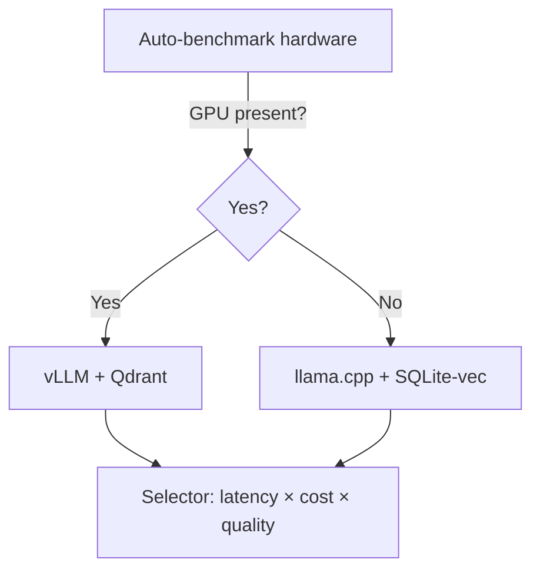

# Strategy OS — OSS-First Tech Stack & Toolchain

> **Goal**: Build an OSS-first, provider-agnostic stack that delivers
> frontier-grade RAG + reasoning, rigorous quality gates, strong governance
> (GDPR + POPIA), and smooth scaling from laptop (CPU-only) to enterprise GPU
> clusters.

---

## Current implementation snapshot (September 2025)

- **Languages & runtime**: Python 3.11 Typer CLI wraps
  `PrometheusOrchestrator`, and a FastAPI gateway in `api/` exposes `/health`
  and `/v1/pipeline/run`. Skeleton Next.js (App Router) and Tauri workspaces
  live in `web/` and `desktop/` with placeholder views and no production build
  wiring yet.
- **Ingestion**: Uses `trafilatura` for web extraction and persists artefacts
  via the in-memory or SQLite stores in `ingestion.persistence`. Optional
  `presidio-*` extras stay disabled unless installed by the operator.
- **Retrieval**: Ships a RapidFuzz lexical backend and hashing embedder. Hybrid
  retrieval wires OpenSearch and Qdrant when those services are reachable; both
  raise runtime warnings and fall back to in-memory search when offline.
- **Reasoning & decision**: Deterministic placeholder agents mirror retrieved
  evidence and auto-approve actions; policy evaluation hooks exist in
  `decision/` but no external engines are invoked yet.
- **Execution**: Defaults to an in-memory adapter. Temporal and webhook
  adapters are available but require external services and credentials supplied
  via configuration.
- **Monitoring & governance**: Emits `MonitoringSignal` events and now boots the
  Python services with structured JSON logging, OTLP tracing, and Prometheus
  metrics that point at the bundled collector stack (Prometheus, Alertmanager,
  Grafana, Loki, Tempo, Langfuse, Phoenix, OpenCost, Keycloak, Vault,
  OpenFGA, OPA, Flipt). Rego policies under `infra/opa/` remain placeholders.
- **Packaging & DX**: Managed with Poetry and offline packaging scripts under
  `scripts/` and `prometheus/packaging/`. Docker Compose bundles all external
  dependencies listed above with defaults sourced from `infra/.env`. Dedicated
  `poetry` extras (`pii`, `rag`, `llm`, `governance`, `integrations`) map to
  strategy OS capabilities so developers can opt into heavy dependencies while
  keeping the core install lean. The Next.js and Tauri workspaces only ship
  baseline lint/test scripts.
- **Limitations**: LLM orchestration, policy enforcement, production‑grade web
  flows, and desktop build pipelines remain roadmap items. Feature flag
  integrations are wired only at the infrastructure layer and the sections
  below capture the fuller target state for planning continuity.

---

## 1) Executive Overview

> **Roadmap context**: The following sections describe the target stack once
> the full product surface ships. They intentionally include capabilities not
> yet implemented in the repository.

- **Languages & runtimes**: **Python** (reasoning/orchestration, data/ML),
  **TypeScript/React** (web), **Rust** (desktop shell via Tauri;
  perf‑critical plugins).
- **Core back end**: **FastAPI** (+ Uvicorn) for APIs; **PostgreSQL** as system
  of record (**pgvector** for embeddings, **pgcrypto** for field encryption);
  **OpenSearch** for BM25 search; **Qdrant** for ANN vectors (or pgvector for a
  single‑DB path).
- **Model layer**: **vLLM** for high‑throughput LLM serving; **llama.cpp** for
  CPU/offline; quantisation via **bitsandbytes** / **AutoGPTQ** / **AWQ**;
  **Sentence‑Transformers** for embeddings & cross‑encoder rerankers.
- **RAG orchestration & evals**: **Haystack** pipelines; **DSPy** for
  prompt/program optimisation; **RAGAS** + **TruLens** for
  groundedness/faithfulness; **HELM** & **MTEB** for continuous model
  benchmarking. The developer CLI ships `prometheus evaluate-rag` to invoke the
  evaluation harness against sample or custom records.
- **Workflows**: **Temporal** for long‑running, retryable, auditable
  workflows; **Redis**/**NATS** for queues/events when needed.
- **Observability & cost**: **OpenTelemetry** SDKs; **Prometheus/Grafana**
  (metrics/SLOs), **Loki** (logs), **Tempo/Jaeger** (traces),
  **Langfuse**/**Phoenix** (LLM traces/evals), **OpenCost** (K8s cost
  accounting).
- **Security & governance**: **Keycloak** (SSO/OIDC/SAML), **Oso**/**OpenFGA**
  (authz), **OPA/Gatekeeper** (policy as code), **Vault** (secrets);
  **Sigstore/cosign** + **SLSA** provenance; **Syft/Grype/Trivy/Semgrep/
  Gitleaks** (SBOM & scanning); **OpenLineage/Marquez** (data lineage). LLM
  safety aligned to **OWASP LLM Top‑10**. **GDPR** (Art. 17) & **POPIA**
  baselines.
- **Collaboration/CRDTs**: **Yjs** + **tiptap/ProseMirror** for real‑time
  co‑editing & offline merges.
- **Front end**: **Next.js/React**, **TanStack Query**, **i18next** (i18n),
  **axe‑core** (a11y), **Apache ECharts**/**Vega‑Lite** for charts.
- **Desktop & CLI**: **Tauri** (desktop), **Typer** (CLI), **OpenAPI/gRPC** for
  SDKs.
- **CI/CD & releases**: **GitHub Actions**, **Docker/BuildKit**,
  **Helm/Kubernetes** (k3s/on‑prem), **Argo CD** + **Argo Rollouts**
  (canary/blue‑green), **OpenFeature + Flipt** (feature flags), Dev Containers
  (repro dev), optional **Nix**.

> Optional paid providers are plug‑ins only (for example: OpenAI, Anthropic,
> Pinecone). They stay opt‑in and are always replaceable.

---

## 2) Capability → Stack Map

1. **Ingestion & normalisation**
   - Stack: **Unstructured**, **Apache Tika**, **pdfplumber**; web via
     **trafilatura**; PII redaction with **Microsoft Presidio**.
   - Notes: Handles PDFs, Office docs, HTML; PII detection at ingest.
2. **Retrieval & knowledge**
   - Stack: **OpenSearch** (BM25) plus **Qdrant/pgvector** for dense vectors;
     reranking via **sentence‑transformers** cross‑encoders.
   - Notes: Hybrid lexical + dense approach with cross‑encoder rerank (e.g.,
     MiniLM‑L6).
3. **Reasoning & synthesis**
   - Stack: **vLLM** (serving), **llama.cpp** (CPU/offline), **DSPy** for prompt
     and program optimisation, **Haystack** pipelines.
   - Notes: Switch models by hardware profile; DSPy powers self‑critique.
4. **Decision core & ledger**
   - Stack: **FastAPI** service with **Postgres** (append‑only JSONB);
     **Oso/OpenFGA** enforce record‑level authorisation.
   - Notes: Append‑only ledger ensures immutability with granular checks.
5. **Evidence & causality**
   - Stack: Graph in **Postgres** (adjacency lists) or **NetworkX**; lineage via
     **OpenLineage/Marquez**.
   - Notes: Links citations and assumptions; lineage back to raw inputs.
6. **Forecasting**
   - Stack: **Prophet**, **statsmodels**, **NumPyro**; dashboards in
     **Grafana**.
   - Notes: Store forecasts with Brier scores for quarter‑over‑quarter
     tracking.
7. **Measurement & anti‑Goodhart**
   - Stack: **Prometheus** (metrics), **Grafana** (dashboards),
     **Alertmanager** (alerts).
   - Notes: Pair leading and lagging indicators with guardrails.
8. **Risk & assurance**
   - Stack: **OPA/Gatekeeper** with monitoring aligned to **NIST SP 800‑137**.
   - Notes: Policy‑as‑code enforces risk tolerances.
9. **Execution spine**
   - Stack: **Temporal** workflows, project management exporters for Jira or
     Asana, idempotent sync keyed by stable IDs.
   - Notes: Supports long‑running, retryable sync without duplicates.
10. **Collaboration (CRDT)**
    - Stack: **Yjs** + **tiptap/ProseMirror**, **y‑websocket**; comments stored
      in **Postgres**.
    - Notes: Real‑time collaboration with offline‑tolerant merges.
11. **Observability**
    - Stack: **OpenTelemetry** into **Tempo/Jaeger** (traces), **Prometheus**
      (metrics), **Loki** (logs), **Langfuse/Phoenix** (LLM), **OpenCost**
      (costs).
    - Notes: End‑to‑end traces with LLM exemplars for auditing.
12. **Security & privacy**
    - Stack: **Keycloak**, **Vault**, **pgcrypto**, **Sigstore/cosign**,
      **SLSA**; scanners **Syft/Grype/Trivy/Semgrep/Gitleaks**; OWASP LLM
      Top‑10 checks.
    - Notes: Implements GDPR/POPIA erasure, signed artefacts, supply chain
      hygiene.
13. **Accessibility & i18n**
    - Stack: **axe‑core** in CI, **i18next** for internationalisation.
    - Notes: WCAG AA+ checks stay automated.
14. **Governance**
    - Stack: **OpenLineage/Marquez** (data lineage), audit trails in
      **Postgres**, policy via **OPA**, reporting in **Grafana**.
    - Notes: Comprehensive audit and policy guardrails.

---

## 3) Architecture Overview (Mermaid)

```mermaid
flowchart LR
  A[User / API] --> B[FastAPI Gateway]
  B -->|AuthN/Z| K(Keycloak / Oso / OpenFGA)
  B --> C[Temporal Workflows]
  C --> D[Retrieval Service]
  D --> E1[OpenSearch (BM25)]
  D --> E2[Qdrant / pgvector (dense)]
  D --> E3[Reranker (cross-encoder)]
  C --> F[vLLM / llama.cpp (Model Gateway)]
  C --> G[Evidence & Ledger (Postgres)]
  C --> H[Execution Sync (PM adapters)]
  subgraph Observability
    O1[OpenTelemetry SDK]-->O2[Tempo/Jaeger]
    O1-->O3[Prometheus→Grafana]
    O1-->O4[Loki Logs]
    O1-->O5[Langfuse/Phoenix]
  end
  B -. traces .-> Observability
```

---

## 4) Runtime Model & Hardware Selection

- **Server/GPU path**: **vLLM** (tensor parallelism, paged attention) for
  high‑throughput serving; apply quantisation where safe.
- **Laptop/CPU path**: **llama.cpp** with 4‑bit (q4_K_M) via
  **bitsandbytes/AWQ**; **SQLite‑vec** stores vectors.



---

## 5) Dev → Test → Release → Deploy Toolchain

### Local dev

- Dev Containers; Python: **Poetry**, **Ruff**, **pytest**, **Hypothesis**;
  Web: **ESLint**, **Prettier**, **Playwright/Cypress**; enforce **pre‑commit**
  hooks.

### CI

- **GitHub Actions** run unit, integration, and UI tests; container images build
  with **BuildKit**. Generate **Syft** SBOMs, scan with
  **Grype/Trivy/Semgrep/Gitleaks**, sign with **cosign** (Sigstore), and emit
  **SLSA** provenance.

### CD

- Ship via **Helm** charts and **Argo CD** (GitOps). **Argo Rollouts** handles
  canary or blue‑green strategies. **OpenFeature + Flipt** control runtime
  flags.

### Observability gates

- OTel traces must span ingest → RAG → decision. Guard Grafana SLOs and require
  Langfuse/Phoenix evaluations in staging before promotion.

```mermaid
flowchart LR
  dev[Dev Container] --> pr[GitHub PR]
  pr -->|Actions| test[Unit/Integration/Playwright]
  test --> sbom[Syft SBOM + Grype/Trivy/Semgrep/Gitleaks]
  sbom --> sign[cosign sign (SLSA provenance)]
  sign --> chart[Helm package]
  chart --> argo[Argo CD (GitOps)]
  argo --> rollout[Argo Rollouts Canary/Blue-Green]
  rollout --> prod[Cluster]
  prod -.OTel.-> obs[Grafana/Tempo/Loki + Langfuse]
```

---

## 6) Data & Storage Choices

- **System of record**: **PostgreSQL** (JSONB for artefacts; **pgcrypto**
  handles field‑level encryption; **pgvector** keeps embeddings when you prefer
  a single database).
- **Search**: **OpenSearch** covers BM25 and facets; **Qdrant** serves HNSW
  vectors at scale (or **pgvector** for unified ops with
  **SQLite‑vec**/**DuckDB vss** on desktop).
- **Security**: Enforce TLS everywhere; combine platform encryption with
  **pgcrypto**. Add application‑layer encryption for embeddings when
  sovereignty demands it.

---

## 7) Model, RAG & Evaluation Layer

- **Serving**: **vLLM** drives throughput with policy fallbacks to
  **llama.cpp** on constrained nodes.
- **Embeddings**: **Sentence‑Transformers** family; select models with
  **MTEB** results plus domain evaluation sets.
- **Reranking**: Cross‑encoders (for example, _ms‑marco‑MiniLM‑L‑6‑v2_).
- **Quantisation**: **bitsandbytes**, **AutoGPTQ**, and **AWQ** manage
  speed/latency trade‑offs.
- **Pipelines**: **Haystack** (retriever → reader → reranker) with **DSPy** for
  prompt programs and self‑correction.
- **Evaluation**: **RAGAS** (groundedness/citation), **TruLens** (feedback
  traces), **HELM** for broader LLM evaluation; embed **MTEB** for embeddings.

---

## 8) Security, Privacy & Compliance

- **AuthN/SSO**: **Keycloak** (OIDC/SAML). **AuthZ** via **Oso/OpenFGA** for
  RBAC and relationship permissions.
- **Secrets**: **Vault** manages secrets; **OPA/Gatekeeper** applies cluster and
  app policy (approval gates, data egress blocks).
- **Supply chain**: **Sigstore/cosign** and **SLSA** provenance; CI scans use
  **Syft/Grype/Trivy/Semgrep/Gitleaks**.
- **LLM safety**: Adopt **OWASP LLM Top‑10** checks (prompt injection,
  data leakage, output handling) inside reviews and tests.
- **Regulatory**: Implement **GDPR Art. 17** erasure and **POPIA**
  retention/minimisation; document SAR/DSAR flows with lineage and deletion
  logs.

---

## 9) Front‑End, UX & Accessibility

- **Stack**: **Next.js/React**, **TanStack Query** for data, **i18next** for
  i18n, **axe‑core** in CI for WCAG AA+, and **ECharts/Vega‑Lite** for argument
  maps, forecasts, and risk heatmaps.
- **CRDT collaboration**: **Yjs** + **tiptap/ProseMirror** with
  **y‑websocket** and offline IndexedDB persistence.

---

## 10) Packaging & Deployment Matrix

- **Web (cloud or on‑prem)**
  - Packaging: Docker images with **Helm** on **Kubernetes** (k3s for
    on‑prem). **Argo CD** drives GitOps while **Argo Rollouts** manage
    progressive delivery.
  - Notes: Achieve zero‑downtime canary/blue‑green releases and control
    features via **OpenFeature + Flipt**.
- **Desktop**
  - Packaging: **Tauri** app (Rust shell + web UI) with local
    **SQLite‑vec**/**DuckDB vss** and **llama.cpp**. Offline PM exports sync via
    REST when online.
  - Notes: Provides full offline RAG with background sync.
- **CLI/SDK**
  - Packaging: **Typer** (Python CLI), **OpenAPI** for REST SDKs, **gRPC** for
    high‑performance internal calls.
  - Notes: Keeps automation and integration straightforward.

---

## 11) Minimal “Golden Path” (First Build)

1. **Postgres** (+ pgvector/pgcrypto), **OpenSearch**, **Qdrant**
2. **FastAPI** + **Temporal** + **vLLM**
3. **OpenTelemetry** + **Grafana stack**, **Langfuse**
4. **Keycloak**, **Vault**, **OPA**
5. **GitHub Actions** → **Helm/K8s** with **Argo CD/Rollouts**,
   **OpenFeature + Flipt**

Delivers strong defaults, clear swap points, and immediate auditability.

---

## 12) Notes on Choices (Evidence‑Gated)

- **Throughput & latency**: vLLM targets high throughput (continuous
  batching/paged attention) while **llama.cpp** keeps CPU‑only viable.
- **Hybrid retrieval**: OpenSearch delivers BM25/facets; Qdrant/pgvector power
  ANN; cross‑encoder reranking improves top‑k.
- **Evaluation discipline**: HELM and MTEB prevent hype‑driven choices;
  RAGAS/TruLens quantify faithfulness and citations.
- **Policy & compliance**: **OPA/Gatekeeper** keeps governance explicit;
  Sigstore/SLSA secure the supply chain; GDPR/POPIA covered via lineage and
  **pgcrypto**‑backed deletion.

---

## 13) Provenance Block (for this stack recommendation)

- **Data**: Official docs and benchmarks for serving, retrieval, evaluation,
  security, and CI/CD components.
- **Methods**: OSS‑first selection, aligned to standards (CNCF where possible)
  and mapped to requirements (hardware adaptive, GDPR/POPIA, zero lock‑in).
- **Key results**: Hybrid RAG with throughput, observability, and governance.
  Scales from laptop (llama.cpp + SQLite‑vec) to cluster (vLLM +
  Qdrant/OpenSearch).
- **Uncertainty**: Rapid library/model churn; embedding or reranker leaders may
  shift (track MTEB). Quantisation trade‑offs vary by model.
- **Safer alternative**: Start single database (Postgres + pgvector +
  pgcrypto) with Haystack pipelines; add OpenSearch/Qdrant later behind
  feature flags.
