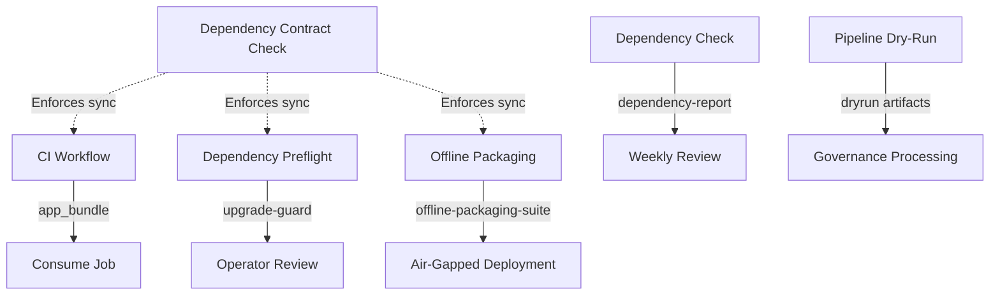

# Workflow Orchestration Guide

## Overview

This document describes how the six main GitHub workflows coordinate to provide a comprehensive CI/CD pipeline with dependency management, offline packaging, and autoremediation capabilities.

**✨ New**: Enhanced orchestration with unified coordinator! See [orchestration-enhancement.md](./orchestration-enhancement.md) for:
- `prometheus orchestrate` CLI commands
- Full workflow automation (dependency + packaging)
- Local ↔ Remote synchronization
- State management and intelligent recommendations
- Programmatic API for custom orchestration

## Workflow Architecture

### Primary Workflows

1. **CI (`ci.yml`)** - Main build, test, and package workflow
   - Triggers: Push to main, PRs, manual dispatch
   - Dependencies: None
   - Outputs: `app_bundle` artifact (dist/ with wheel + wheelhouse)

2. **Dependency Preflight (`dependency-preflight.yml`)** - Validate dependency changes
   - Triggers: Schedule (daily 3AM), PRs touching dependencies, manual
   - Dependencies: None
   - Outputs: `upgrade-guard` artifact with assessment and snapshots

3. **Dependency Contract Check (`dependency-contract-check.yml`)** - Ensure contract sync
   - Triggers: Push to main, PRs, manual
   - Dependencies: None
   - Outputs: None (enforces clean state)

4. **Dependency Check (`dependency-check.yml`)** - Weekly dependency monitoring
   - Triggers: Schedule (weekly Monday 9AM), manual
   - Dependencies: None
   - Outputs: `dependency-report` artifact

5. **Offline Packaging (`offline-packaging-optimized.yml`)** - Multi-platform wheel building
   - Triggers: Schedule (weekly Monday 3AM), manual with platform selection
   - Dependencies: None
   - Outputs: `offline-packaging-suite-optimized` artifact
   - **Key Features**:
     - Uses **cibuildwheel** for multi-version Python wheel building (3.11, 3.12)
     - Builds for Linux (x86_64, aarch64), macOS (x86_64, arm64), Windows (AMD64)
     - Integrates with `prometheus deps preflight`, `prometheus deps guard`
     - Includes `prometheus offline-package` and `prometheus offline-doctor`
     - Generates remediation recommendations for failures
     - Creates comprehensive air-gapped deployment bundle

6. **Pipeline Dry-Run (`pipeline-dry-run.yml`)** - Test pipeline with fixtures
   - Triggers: Push to main (pipeline code changes), schedule (daily 6AM), manual
   - Dependencies: None
   - Outputs: `dryrun-{shard}-{run_id}` artifacts per shard

## Coordination Patterns

### Shared Components

All workflows now use standardized composite actions for common operations:

#### `setup-python-poetry` Action
- Standardizes Python and Poetry installation
- Ensures consistent Poetry version (1.8.3)
- Provides optional pip caching and poetry-plugin-export
- Used by: All workflows requiring Python/Poetry

#### `build-wheelhouse` Action
- Encapsulates wheelhouse building logic
- Handles extras, dev dependencies, pip-audit inclusion
- Generates consistent manifests
- Validates with offline_doctor.py
- Used by: CI, Dependency Preflight, Offline Packaging

#### `verify-artifacts` Action
- Standardizes artifact verification
- Runs offline_doctor.py and verify_artifacts.sh
- Provides configurable failure modes
- Used by: CI, Offline Packaging

### Artifact Flow

### Dependency Management Pipeline

The dependency management workflows coordinate to provide a complete lifecycle:

1. **Daily Preflight** (`dependency-preflight.yml`)
   - Runs preflight checks
   - Executes upgrade guard analysis
   - Rehearses wheelhouse build
   - Creates guard snapshots
   - Ensures Temporal schedules are configured

2. **On-Demand Contract Sync** (`dependency-contract-check.yml`)
   - Validates dependency contract outputs
   - Ensures `prometheus deps sync` has been run
   - Blocks PRs if drift detected

3. **Weekly Monitoring** (`dependency-check.yml`)
   - Reports outdated dependencies
   - Provides summary for manual review
   - No automatic actions

4. **Weekly Multi-Platform Build** (`offline-packaging-optimized.yml`)
   - Builds wheels for Linux, macOS, Windows
   - Creates comprehensive wheelhouse archives
   - Validates across platforms
   - Generates air-gapped deployment bundle

### CI Pipeline Integration

The CI workflow integrates with dependency management:

1. **Build Phase**
   - Validates dependency artifacts with `manage-deps.sh --check`
   - Builds project wheel
   - Builds wheelhouse using `build-wheelhouse` action
   - Enforces binary-only wheelhouse policy

2. **Validation Phase**
   - Verifies artifacts with `verify-artifacts` action
   - Runs offline doctor checks
   - Creates comprehensive summary

3. **Cleanup Phase**
   - Prunes old artifacts (keeps last 5)
   - Coordinates with offline-packaging cleanup

## Cross-Cutting Concerns

### 1. Wheelhouse Building

**Standardization**: All workflows use the `build-wheelhouse` composite action, which internally calls `scripts/build-wheelhouse.sh`.

**Configuration**:
- Extras: `pii,observability,rag,llm,governance,integrations`
- Platform detection: Automatic based on runner OS
- Include dev: Configurable (default true for CI, false for production)

**Multi-Platform Support**:
- **Offline Packaging workflow** uses **cibuildwheel** for comprehensive platform coverage
- Builds wheels for Python 3.11 and 3.12 across:
  - Linux: x86_64, aarch64 (via QEMU if needed)
  - macOS: x86_64 (Intel), arm64 (Apple Silicon)
  - Windows: AMD64
- Local builds use `python -m build` for current platform only

**Deduplication**: 
- CI builds wheelhouse for immediate use (current platform)
- Offline Packaging builds multi-platform wheelhouses via cibuildwheel for distribution
- Dependency Preflight rehearses but doesn't publish

**Integration with CLI**:
- Remote builds integrate with `prometheus offline-package` CLI command
- Artifacts include dependency preflight and upgrade guard results
- Remediation recommendations generated for any failures
- Local sync via `prometheus deps sync --apply --force`

### 2. Poetry Version Consistency

**Version**: 1.8.3 (standardized across all workflows)

**Installation**: Via `setup-python-poetry` action
- Ensures pip upgrade
- Installs poetry-plugin-export when needed
- Verifies installation

### 3. Artifact Verification

**Standardization**: `verify-artifacts` action provides consistent validation

**Checks**:
- Offline doctor validation
- verify_artifacts.sh script execution
- BUILD_INFO presence
- Wheelhouse structure validation

### 4. Cleanup and Retention

**Artifact Cleanup**:
- CI: Keeps last 5 `app_bundle` artifacts
- Offline Packaging: Keeps last 5 `offline-packaging-suite-optimized` artifacts
- Dry-Run: 7-day retention per shard

**Coordination**:
- Cleanup jobs run after all other jobs complete
- Use consistent artifact naming patterns
- Never clean on PR builds

### 5. Remediation Integration

**Pipeline Dry-Run**:
- Captures runtime failures
- Generates remediation summaries
- Processes governance hooks
- Creates GitHub issues for severe findings

**Autoremediation**:
- Enabled via `PROMETHEUS_AUTOREMEDIATION=1` environment variable
- Logs failures to structured JSON
- Integrates with `prometheus.remediation.github_summary`

**WheelhouseRemediator**:
- Analyzes wheelhouse build failures
- Suggests fallback versions
- Provides escape hatch recommendations
- Used by offline packaging workflow

## Configuration Files

### Shared Configuration

- `configs/dependency-profile.toml` - Dependency policy contract
- `configs/defaults/dependency_snapshot_request.json` - Temporal snapshot config
- `configs/defaults/dependency_snapshot_notification.json` - Notification config
- `constraints/runtime-roots.txt` - Runtime dependency roots

### Workflow-Specific Variables

Set via repository secrets/variables:

- `TEMPORAL_SNAPSHOT_HOST` - Temporal service endpoint
- `TEMPORAL_SNAPSHOT_NAMESPACE` - Temporal namespace
- `TEMPORAL_SNAPSHOT_TASK_QUEUE` - Task queue name
- `DEPENDENCY_GUARD_SLACK_WEBHOOK` - Slack notification webhook

## Operator Guidance

### Running Workflows Manually

1. **Full CI Run**: Use workflow_dispatch on `ci.yml`
2. **Dependency Check**: Trigger `dependency-preflight.yml` manually
3. **Multi-Platform Build**: Trigger `offline-packaging-optimized.yml` with platform selection
4. **Contract Validation**: Automatic on PR, or trigger `dependency-contract-check.yml`

### Troubleshooting

#### Wheelhouse Build Failures

1. Check `build-wheelhouse` action output
2. Review `platform_manifest.json` for sdist usage
3. Check remediation summary in wheelhouse/remediation/
4. Use `ALLOW_SDIST_FOR` environment variable as temporary escape hatch

#### Dependency Guard Warnings

1. Review `upgrade-guard` artifact
2. Check `var/upgrade-guard/assessment.json`
3. Read `var/upgrade-guard/summary.md` for recommendations
4. Run `prometheus deps upgrade` locally to test changes

#### Artifact Verification Failures

1. Check `verify-artifacts` action output
2. Review offline_doctor.py output (table format)
3. Check verify_artifacts.sh logs
4. Ensure all required files are present in dist/

## Best Practices

1. **Always validate locally** before pushing dependency changes
   - Run `scripts/manage-deps.sh` after poetry.lock updates
   - Check `scripts/deps-preflight.sh --check` output

2. **Monitor guard assessments** from preflight runs
   - Review weekly guard summaries
   - Address "needs-review" status promptly

3. **Test offline packages** before air-gapped deployment
   - Download `offline-packaging-suite-optimized` artifact
   - Extract and validate with `deploy.sh` script

4. **Coordinate cleanup** to avoid storage issues
   - Let automatic cleanup run (keeps last 5)
   - Manually clean old artifacts if storage exceeds limits

5. **Use composite actions** for new workflow additions
   - Leverage `setup-python-poetry` for Python setup
   - Use `build-wheelhouse` for wheelhouse generation
   - Use `verify-artifacts` for validation

## Migration Path

For workflows not yet using composite actions:

1. Replace inline Python/Poetry setup with `setup-python-poetry` action
2. Replace inline wheelhouse building with `build-wheelhouse` action
3. Replace inline verification with `verify-artifacts` action
4. Update to Poetry 1.8.3
5. Test locally and in a PR before merging

## Future Improvements

1. **Shared artifact caching** between CI and Offline Packaging
2. **Dependency upgrade automation** with guard approval gates
3. **Multi-platform CI builds** for platform-specific testing
4. **Enhanced remediation** with automatic PR creation
5. **Notification consolidation** for Slack/Teams/Email
